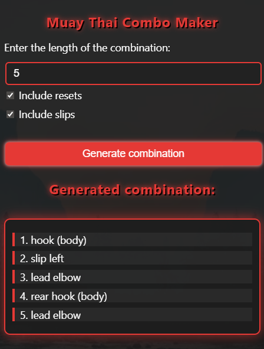

# Combo maker

In Muay Thai classes we work on drilling combinations of strikes, and often the combos follow a basic pattern, demonstrated in the [Dutch drill](https://www.youtube.com/watch?v=aVZnAogUyVU&loop=0). The core (hips and shoulders, at least) alternates turning left and right on each move. For example, in an orthodox stance, a jab (left hand strike, shoulders turn to the right) is often followed by a cross (right hand strike, shoulders turn to the left), but just as easily could be followed by a rear kick instead (right leg kick, shoulders and hips turn to the left).

## How it works

I listed the moves I wanted to include in the script, and I filled out a boolean matrix to determine which moves can follow which. The main function picks a move randomly, adds it to the combination *if* it's allowed to follow the previous move, and repeats. The script can generate combinations of any length.

## Try it out

https://patrickfarley.github.io/combo-maker/

